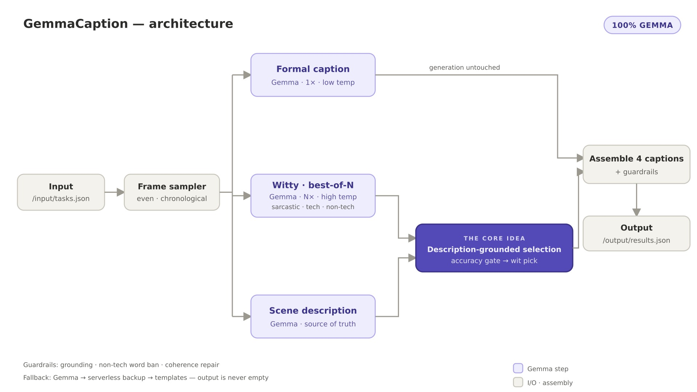

# GemmaCaption

**Multi-Style Video Captioning — 100% Gemma**

GemmaCaption captions a video in **four distinct styles** — `formal`, `sarcastic`, `humorous_tech`, and `humorous_non_tech` — using only Google **Gemma-4-31B**. Every step — perception, writing, fact-checking, and selection — runs on Gemma, and every witty caption is fact-checked against the actual frames before it is chosen.

Built for the **AMD Developer Hackathon (ACT II) · Track 2 — Video Captioning**.



## How it works

A single self-contained container reads `/input/tasks.json`, downloads each clip, and writes `/output/results.json`.

1. **Frame sampling** — frames are sampled evenly across the whole clip, in chronological order.
2. **Generation (all Gemma)** — the factual `formal` caption is written in one low-temperature pass; for the three humor styles, Gemma drafts **N candidates** at higher temperature.
3. **Grounding** — Gemma produces an independent, strictly factual scene description — the *source of truth*.
4. **Description-grounded selection** — a two-criterion selector picks the best witty caption per style: an **accuracy gate** drops any candidate that asserts something the description doesn't support (catching joke-driven hallucinations — e.g. a "blue bus" when the clip shows a red one), then a **wit pick** keeps the boldest survivor.

Generation is never altered by the description, so accuracy improves without diluting the personas.

## The four voices

Each style is governed by a hand-tuned persona contract:

| Style | Register |
|---|---|
| `formal` | News-wire / stock-footage. Present tense, third person, every clause a checkable fact. |
| `sarcastic` | Dry, deadpan irony aimed at one real thing on screen — the facts stay true, only the attitude bites. |
| `humorous_tech` | One sustained software metaphor (deploys, merge conflicts, latency) mapped onto the real action. |
| `humorous_non_tech` | Warm everyday-observational comedy — with a hard ban on any technology word. |

Factual styles run at low temperature for precision; the witty styles run hot for range.

## Guardrails & reliability

- **Grounding rules** — never invent names, brands, counts, or on-screen text.
- **Non-tech word ban** — regenerates `humorous_non_tech` if a technology word slips in.
- **Coherence repair** — catches high-temperature garbling and regenerates once.
- **Fallback chain** — Gemma → serverless backup → deterministic templates; output is never empty.
- **Complete at t=0** — a valid `results.json` is written up front and overwritten as captions land.
- **Time watchdog** — every run stays under the harness time cap.

## Input / output

The container reads and writes exactly two files.

**`/input/tasks.json`**
```json
[
  {
    "task_id": "clip-001",
    "video_url": "https://example.com/clip.mp4",
    "styles": ["formal", "sarcastic", "humorous_tech", "humorous_non_tech"]
  }
]
```

**`/output/results.json`**
```json
[
  {
    "task_id": "clip-001",
    "captions": {
      "formal": "...",
      "sarcastic": "...",
      "humorous_tech": "...",
      "humorous_non_tech": "..."
    }
  }
]
```

## Build & run

The container is self-contained — it downloads the videos itself and needs only the two mounted paths:

```bash
docker run --rm \
  -v "$PWD/input:/input:ro" \
  -v "$PWD/output:/output" \
  <your-image>
```

To build it (bake your own keys — full walkthrough in **[BUILD_INSTRUCTIONS.md](BUILD_INSTRUCTIONS.md)**):

```bash
docker build --platform linux/amd64 \
  --build-arg HF_TOKEN=<your-hf-token> \
  -t gemmacaption .
```

Requires a Hugging Face token with Inference Providers access and the [Gemma license](https://huggingface.co/google/gemma-4-31B-it) accepted. A Fireworks API key can be supplied as an optional fallback.

## Code map

| Path | Role |
|---|---|
| `app/main.py` | Orchestrator — async fan-out, watchdog, incremental atomic writes, always exit 0 |
| `app/media.py` | Download + single-pass ffmpeg frame sampling across the whole clip |
| `app/backends.py` | OpenAI-compatible client (HF Gemma / Fireworks) with retries and best-of-N |
| `app/pipeline.py` | Captioning pipeline, including best-of-N + description-grounded selection |
| `app/styles.py` | The four style contracts and template fallbacks |
| `app/schema.py` | Robust JSON extraction + output-schema validation |
| `app/config.py` | Environment configuration with baked defaults |
| `Dockerfile` | `python:3.12-slim` + ffmpeg — thin, no local model weights |

## Repository layout

- **`main`** — the submission: `app/`, the `Dockerfile`, and the presentation / architecture assets.
- **`all-code`** — the full development codebase: every pipeline variant, the experimental Dockerfiles, tests, and tools.

---

*AMD Developer Hackathon · Track 2 — Video Captioning · Best Use of Gemma*
